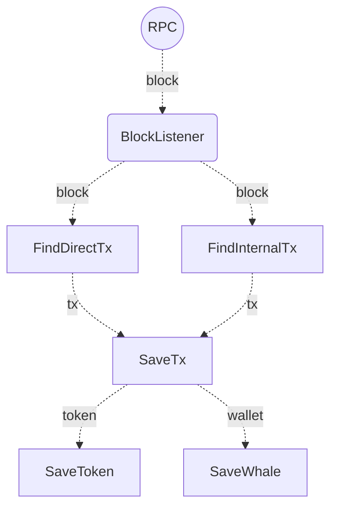

Everything starts in the BlockListener usecase. It will listen blockchain blocks with the json rpc provider.
All the communications are asyncrhonous via RabbitMQ to avoid losing data and increase availability.

